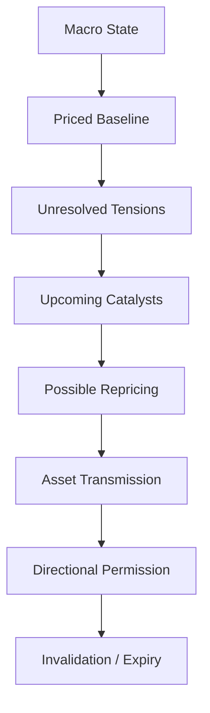

# Weekly Macro Map

> [!abstract] Research mandate
> Construct a point-in-time, source-controlled, model-aware and falsifiable understanding of **Weekly Macro Map**. Canonical doctrine is linked; this note contains the topic-specific research object.

## Definition and economic object

**Weekly Macro Map** is a research object inside the institutional research process, its roles, information boundaries, controls, and decision handoffs. The analyst must isolate the measurable state, the expectation already embedded in prices, the mechanism connecting them, and the horizon on which that inference can survive.

For **Weekly Macro Map**, the relevant institutional domain is **orientation**: the institutional research process, its roles, information boundaries, controls, and decision handoffs. Classify every input as observation, derived measurement, model estimate, market-implied estimate, forecast, causal claim, scenario assumption, judgment, or decision rule.

## Research questions

1. What exact state or mechanism does **Weekly Macro Map** represent, in what unit, population, instrument, and convention?
2. Which **Weekly Macro Map** observations existed at the decision cutoff, which are estimates, and which are revised?
3. What distribution about **Weekly Macro Map** is embedded in consensus, curves, options, valuation, positioning, or physical basis?
4. Which market or variable must lead if the proposed **Weekly Macro Map** mechanism is active?
5. What rival model can create the same target move while **Weekly Macro Map** is unchanged?
6. How do regime, horizon, positioning, liquidity, carry, and implementation alter the payoff?
7. Which predeclared evidence rejects, caps, or expires the **Weekly Macro Map** decision?

## Identities and model skeleton

$$
DecisionQuality=f(Evidence,Calibration,Process,Execution,Governance)
$$

$$
Utility(a)=\sum_s P(s|\mathcal I_t)U(a,s)
$$

For **Weekly Macro Map**, document every variable, unit, convention, sample, parameter, regularizer, and uncertainty estimate. An identity constrains possible stories; it does not estimate an elasticity or prove a causal channel.

## Measurement architecture

- **Measurement 1 for Weekly Macro Map:** research question and decision owner.
- **Measurement 2 for Weekly Macro Map:** information timestamp and evidence status.
- **Measurement 3 for Weekly Macro Map:** forecast distribution and priced baseline.
- **Measurement 4 for Weekly Macro Map:** permission, risk budget, veto, and expiry.
- **Measurement 5 for Weekly Macro Map:** decision record, attribution, and model-change history.

The **Weekly Macro Map** dataset must satisfy [[00 Core Standards/16 Data Dictionary and Release Calendar Standard]] and preserve first releases, revisions, and admissible timestamps under [[00 Core Standards/03 Point-in-Time and Bitemporal Data Standard]].

## Estimation and validation stack

- **Model layer 1 for Weekly Macro Map:** decision decomposition.
- **Model layer 2 for Weekly Macro Map:** pre-mortem and red-team review.
- **Model layer 3 for Weekly Macro Map:** claim–evidence matrices.
- **Model layer 4 for Weekly Macro Map:** calibration scoring.
- **Model layer 5 for Weekly Macro Map:** process attribution and control testing.

Validate the **Weekly Macro Map** stack against simple point-in-time benchmarks. Report forecast/density error, probability calibration, regime stability, vintage sensitivity, feature ablation, latency, cost, and economic value. Register implementation under [[00 Core Standards/14 Model Card Standard]].

## Multihorizon behavior

| Horizon | Topic-specific role |
|---|---|
| Structural | In the **Weekly Macro Map** research object, institutional mandate, incentives, and architecture remain valid until governance or strategy changes. |
| Cyclical | In the **Weekly Macro Map** research object, resource allocation and model priorities adapt to the current macro regime. |
| Tactical | In the **Weekly Macro Map** research object, committee cadence, escalation, and evidence thresholds respond to catalyst density. |
| Daily/Event | In the **Weekly Macro Map** research object, decision ownership, cutoff times, and vetoes must be explicit before risk is taken. |

Conflicts involving **Weekly Macro Map** must retain separate state objects and be resolved through [[00 Core Standards/04 Multihorizon Inheritance and Conflict Resolution]], never by an undocumented average score.

## Causal transmission

1. **Weekly Macro Map channel 1:** test `research object → committee interpretation`.
2. **Weekly Macro Map channel 2:** test `committee interpretation → portfolio permission`.
3. **Weekly Macro Map channel 3:** test `permission → execution mandate`.
4. **Weekly Macro Map channel 4:** test `outcome → attribution and learning`.

**Weekly Macro Map asset translation:** Process: decision rights, cutoff, veto, and auditability are part of the edge. Predeclare the leader. If the target moves without the leader or with contradictory independent evidence, reduce the **Weekly Macro Map** posterior or activate a rival explanation.

## Fundamental decision application

- Intraday governance: [[00 Core Standards/19 Fundamental-Only Research Boundary and Implementation Standard]]

## Multi-day decision application

- Multi-day governance: [[00 Core Standards/04 Multihorizon Inheritance and Conflict Resolution]]

## Falsification and known failure modes

- **Failure test 1 for Weekly Macro Map:** storytelling without a decision object.
- **Failure test 2 for Weekly Macro Map:** authority replacing evidence.
- **Failure test 3 for Weekly Macro Map:** hindsight contamination.
- **Failure test 4 for Weekly Macro Map:** unclear ownership.
- **Failure test 5 for Weekly Macro Map:** process bloat that delays time-sensitive decisions.

Score **Weekly Macro Map** separately for state estimation, expectation measurement, causal transmission, expression, timing, sizing, execution, and residual noise. Neither a winning outcome nor a losing outcome alone establishes research quality.

## Required research record

- Schema: [[00 Core Standards/17 Context Object and Permission Schema Standard]]

## Preserved subject-specific foundation

This material survived consolidation because it contains subject-specific instruction for **Weekly Macro Map**, not the former repeated institutional wrapper.

The weekly map is the bridge between research and execution. It is a **living state machine**, not a fixed prediction.

## Map Architecture

## Layer 1 — Regime Label

Use two labels, not one:

### Economic regime
- reflation;
- disinflationary growth;
- overheating;
- stagflation;
- contraction;
- recovery;
- policy-induced slowdown.

### Market regime
- liquidity expansion;
- liquidity withdrawal;
- risk-premium compression;
- risk-premium expansion;
- duration leadership;
- cyclical leadership;
- defensive rotation;
- deleveraging.

The economic and market regimes may differ because price discounts the future.

## Layer 2 — Driver Ranking

Rank drivers by expected marginal influence:

| Rank | Driver | Direction | Confidence | Persistence | Main assets |
|---:|---|---|---|---|---|
| 1 | Example: real-yield repricing | Up | High | 2–5 days | NQ, Gold, USD |
| 2 | Example: oil supply shock | Up | Medium | 1–3 weeks | Oil, inflation, rates |
| 3 | Example: month-end flow | Equity supportive | Low | 1–2 sessions | ES, NQ |

A high-impact driver with low persistence should not dictate a ten-day swing thesis.

## Layer 3 — Pricing Matrix

| Domain | Current price implication | Vulnerability |
|---|---|---|
| Policy | Cuts/hikes implied | Too dovish / too hawkish |
| Growth | Soft landing / slowdown | Revision risk |
| Inflation | Continued disinflation / renewed pressure | Composition risk |
| Earnings | Upgrade / downgrade cycle | Concentration risk |
| Risk premium | Compressed / elevated | Shock sensitivity |
| Commodities | Tight / balanced / surplus | Supply elasticity |
| Dollar | Funding stress / benign liquidity | Relative-rate shift |

## Layer 4 — Scenario Grid

Use conditional language:

- **If growth remains resilient and inflation cools**, risk assets can absorb moderate yields.
- **If growth remains resilient because inflation stays firm**, front-end yields and the dollar may tighten conditions and pressure duration.
- **If growth weakens but policy easing is credible and credit remains stable**, duration assets may outperform.
- **If growth weakens with credit stress**, easing expectations may not offset risk-premium expansion.

This prevents the simplistic “weak data = dovish = bullish” error.

## Layer 5 — Cross-Asset Validation

A valid weekly thesis should normally have at least two independent confirmations:

- rates;
- dollar;
- credit;
- volatility;
- breadth/leadership;
- commodity structure;
- relevant FX cross.

Confirmation is not universal agreement. Markets can lead or lag. The test is whether the divergence has a plausible timing or structural explanation.

## Layer 6 — Permission Table

| Asset | Permission | Core reason | Confirmation | Invalidation |
|---|---|---|---|---|
| NQ | `LONG_ONLY` / etc. | Driver | Market | Condition |
| ES | | | | |
| Gold | | | | |
| Oil | | | | |
| USD | | | | |
| Rates | | | | |

Permissions are constraints on execution, not predictions of every candle.

## Midweek Update Rule

Update the map only when one of these occurs:

1. New information changes the state estimate.
2. Market pricing changes enough to remove the original gap.
3. The dominant transmission channel fails.
4. Positioning/volatility makes the expression materially asymmetric.
5. A scenario moves outside its prior probability range.
6. The thesis reaches its expiry.

Do **not** rewrite the map simply because price moves against you intraday.

## Weekly Map Quality Score

Score 0–2 for each:

- State clarity.
- Expectations clarity.
- Pricing-gap clarity.
- Transmission clarity.
- Scenario differentiation.
- Invalidation specificity.
- Asset-expression quality.
- Horizon consistency.

A score below 10/16 means conviction must be capped.

---

## Primary source routes for Weekly Macro Map

- [[65 Source Registry and Claim Lineage/BIS — Bank for International Settlements]]
- [[65 Source Registry and Claim Lineage/IMF_GFSR — IMF Global Financial Stability Report]]
- [[65 Source Registry and Claim Lineage/FED_FSR — Federal Reserve — Financial Stability Report]]
- [[65 Source Registry and Claim Lineage/IOSCO — International Organization of Securities Commissions]]

## Canonical controls

- [[00 Core Standards/01 Research Object and Decision Contract]]
- [[00 Core Standards/02 Evidence Source Lineage and Claim Types]]
- [[00 Core Standards/06 Causal Identification and Rival Models]]
- [[00 Core Standards/07 Permission Proof and Incremental Edge]]
- [[00 Core Standards/09 Portfolio Liquidity and Implementation Governance]]
