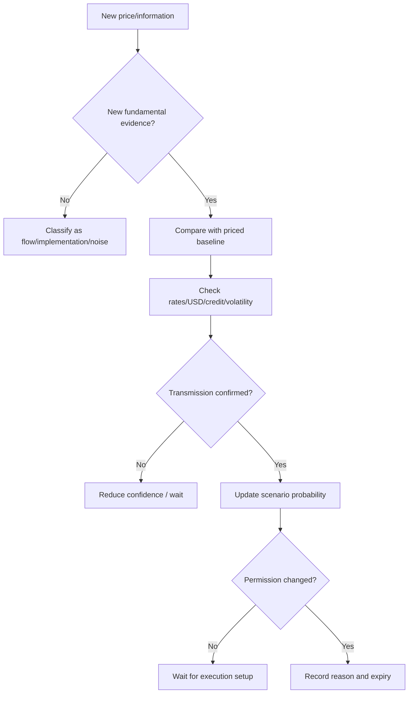

# Live Session Decision Process

> [!abstract] Research mandate
> Construct a point-in-time, source-controlled, model-aware and falsifiable understanding of **Live Session Decision Process**. Canonical doctrine is linked; this note contains the topic-specific research object.

## Definition and economic object

**Live Session Decision Process** is a research object inside the institutional research process, its roles, information boundaries, controls, and decision handoffs. The analyst must isolate the measurable state, the expectation already embedded in prices, the mechanism connecting them, and the horizon on which that inference can survive.

For **Live Session Decision Process**, the relevant institutional domain is **orientation**: the institutional research process, its roles, information boundaries, controls, and decision handoffs. Classify every input as observation, derived measurement, model estimate, market-implied estimate, forecast, causal claim, scenario assumption, judgment, or decision rule.

## Research questions

1. What exact state or mechanism does **Live Session Decision Process** represent, in what unit, population, instrument, and convention?
2. Which **Live Session Decision Process** observations existed at the decision cutoff, which are estimates, and which are revised?
3. What distribution about **Live Session Decision Process** is embedded in consensus, curves, options, valuation, positioning, or physical basis?
4. Which market or variable must lead if the proposed **Live Session Decision Process** mechanism is active?
5. What rival model can create the same target move while **Live Session Decision Process** is unchanged?
6. How do regime, horizon, positioning, liquidity, carry, and implementation alter the payoff?
7. Which predeclared evidence rejects, caps, or expires the **Live Session Decision Process** decision?

## Identities and model skeleton

$$
DecisionQuality=f(Evidence,Calibration,Process,Execution,Governance)
$$

$$
Utility(a)=\sum_s P(s|\mathcal I_t)U(a,s)
$$

For **Live Session Decision Process**, document every variable, unit, convention, sample, parameter, regularizer, and uncertainty estimate. An identity constrains possible stories; it does not estimate an elasticity or prove a causal channel.

## Measurement architecture

- **Measurement 1 for Live Session Decision Process:** research question and decision owner.
- **Measurement 2 for Live Session Decision Process:** information timestamp and evidence status.
- **Measurement 3 for Live Session Decision Process:** forecast distribution and priced baseline.
- **Measurement 4 for Live Session Decision Process:** permission, risk budget, veto, and expiry.
- **Measurement 5 for Live Session Decision Process:** decision record, attribution, and model-change history.

The **Live Session Decision Process** dataset must satisfy [[00 Core Standards/16 Data Dictionary and Release Calendar Standard]] and preserve first releases, revisions, and admissible timestamps under [[00 Core Standards/03 Point-in-Time and Bitemporal Data Standard]].

## Estimation and validation stack

- **Model layer 1 for Live Session Decision Process:** decision decomposition.
- **Model layer 2 for Live Session Decision Process:** pre-mortem and red-team review.
- **Model layer 3 for Live Session Decision Process:** claim–evidence matrices.
- **Model layer 4 for Live Session Decision Process:** calibration scoring.
- **Model layer 5 for Live Session Decision Process:** process attribution and control testing.

Validate the **Live Session Decision Process** stack against simple point-in-time benchmarks. Report forecast/density error, probability calibration, regime stability, vintage sensitivity, feature ablation, latency, cost, and economic value. Register implementation under [[00 Core Standards/14 Model Card Standard]].

## Multihorizon behavior

| Horizon | Topic-specific role |
|---|---|
| Structural | In the **Live Session Decision Process** research object, institutional mandate, incentives, and architecture remain valid until governance or strategy changes. |
| Cyclical | In the **Live Session Decision Process** research object, resource allocation and model priorities adapt to the current macro regime. |
| Tactical | In the **Live Session Decision Process** research object, committee cadence, escalation, and evidence thresholds respond to catalyst density. |
| Daily/Event | In the **Live Session Decision Process** research object, decision ownership, cutoff times, and vetoes must be explicit before risk is taken. |

Conflicts involving **Live Session Decision Process** must retain separate state objects and be resolved through [[00 Core Standards/04 Multihorizon Inheritance and Conflict Resolution]], never by an undocumented average score.

## Causal transmission

1. **Live Session Decision Process channel 1:** test `research object → committee interpretation`.
2. **Live Session Decision Process channel 2:** test `committee interpretation → portfolio permission`.
3. **Live Session Decision Process channel 3:** test `permission → execution mandate`.
4. **Live Session Decision Process channel 4:** test `outcome → attribution and learning`.

**Live Session Decision Process asset translation:** Process: decision rights, cutoff, veto, and auditability are part of the edge. Predeclare the leader. If the target moves without the leader or with contradictory independent evidence, reduce the **Live Session Decision Process** posterior or activate a rival explanation.

## Fundamental decision application

- Intraday governance: [[00 Core Standards/19 Fundamental-Only Research Boundary and Implementation Standard]]

## Multi-day decision application

- Multi-day governance: [[00 Core Standards/04 Multihorizon Inheritance and Conflict Resolution]]

## Falsification and known failure modes

- **Failure test 1 for Live Session Decision Process:** storytelling without a decision object.
- **Failure test 2 for Live Session Decision Process:** authority replacing evidence.
- **Failure test 3 for Live Session Decision Process:** hindsight contamination.
- **Failure test 4 for Live Session Decision Process:** unclear ownership.
- **Failure test 5 for Live Session Decision Process:** process bloat that delays time-sensitive decisions.

Score **Live Session Decision Process** separately for state estimation, expectation measurement, causal transmission, expression, timing, sizing, execution, and residual noise. Neither a winning outcome nor a losing outcome alone establishes research quality.

## Required research record

- Schema: [[00 Core Standards/17 Context Object and Permission Schema Standard]]

## Preserved subject-specific foundation

This material survived consolidation because it contains subject-specific instruction for **Live Session Decision Process**, not the former repeated institutional wrapper.

The live process protects the trader from turning every tick into a new macro theory.

## The Three Clocks

Track three clocks simultaneously:

1. **Information clock** — when meaningful information arrives.
2. **Liquidity clock** — when the relevant participants can express it.
3. **Positioning clock** — when forced adjustment, hedging, or profit-taking can occur.

An overnight move may contain information but still reverse when New York liquidity tests it. A release spike may be informative but distorted by options hedging or thin liquidity.

## Live Decision Loop



## Reaction Decomposition

When a catalyst hits, decompose:

\[
\text{Price Reaction} =
\text{Data Surprise}
+ \text{Policy Repricing}
+ \text{Growth/Cash-Flow Repricing}
+ \text{Risk-Premium Change}
+ \text{Positioning/Flow}
\]

The first move may not reveal the dominant component. Observe:

- front-end rates;
- curve;
- real-yield proxy;
- dollar;
- credit/risk proxies;
- index leadership;
- volatility;
- asset-specific physical indicators.

## The 1–5–15–60 Framework

The exact intervals are flexible; the logic is not.

### First minute
- Avoid narrative certainty.
- Identify headline and obvious mechanical reaction.
- Check whether liquidity is abnormal.

### Five minutes
- Read front-end rate and dollar response.
- Determine whether initial price direction is cross-asset coherent.

### Fifteen minutes
- Inspect breadth, leadership, and whether the move holds beyond the first impulse.
- Distinguish repricing from stop cascade.

### Sixty minutes
- Determine whether the catalyst created a new session regime or only a temporary excursion.

For a pure day trade, waiting is often cheaper than interpreting the first print incorrectly.

## Permission Update Rules

Upgrade confidence only when:

- new information supports the thesis;
- the relevant transmission market confirms;
- price behavior shows acceptance, not only a spike;
- the trade still offers valid structure and reward-to-risk.

Downgrade confidence when:

- price moves but the expected transmission fails;
- the move is entirely positioning-driven;
- a second release changes the first interpretation;
- volatility rises without directional information;
- a key market is closed or illiquid.

## Headline Protocol

For unscheduled headlines:

1. Verify the source.
2. Separate statement, proposal, rumor, implementation, and actual economic effect.
3. Estimate durability and reversibility.
4. Identify direct and second-order channels.
5. Do not extrapolate an initial risk-off move into a persistent regime without confirmation.
6. Use `NO_TRADE` when verification is incomplete.

## No Narrative Averaging

A fundamental thesis cannot be used to add repeatedly to a position that has breached its predeclared risk or information limits. After structural invalidation:

- exit according to the execution plan;
- reassess the macro thesis separately;
- re-entry requires a new valid setup;
- never redefine the horizon merely to avoid realizing a loss.

## Session Log Fields

```yaml
timestamp:
new_information:
expected_vs_actual:
rates_reaction:
usd_reaction:
volatility_reaction:
breadth_leadership:
dominant_interpretation:
scenario_probability_change:
permission_before:
permission_after:
reason:
expiry:
```

---

## Primary source routes for Live Session Decision Process

- [[65 Source Registry and Claim Lineage/BIS — Bank for International Settlements]]
- [[65 Source Registry and Claim Lineage/IMF_GFSR — IMF Global Financial Stability Report]]
- [[65 Source Registry and Claim Lineage/FED_FSR — Federal Reserve — Financial Stability Report]]
- [[65 Source Registry and Claim Lineage/IOSCO — International Organization of Securities Commissions]]

## Canonical controls

- [[00 Core Standards/01 Research Object and Decision Contract]]
- [[00 Core Standards/02 Evidence Source Lineage and Claim Types]]
- [[00 Core Standards/06 Causal Identification and Rival Models]]
- [[00 Core Standards/07 Permission Proof and Incremental Edge]]
- [[00 Core Standards/09 Portfolio Liquidity and Implementation Governance]]
