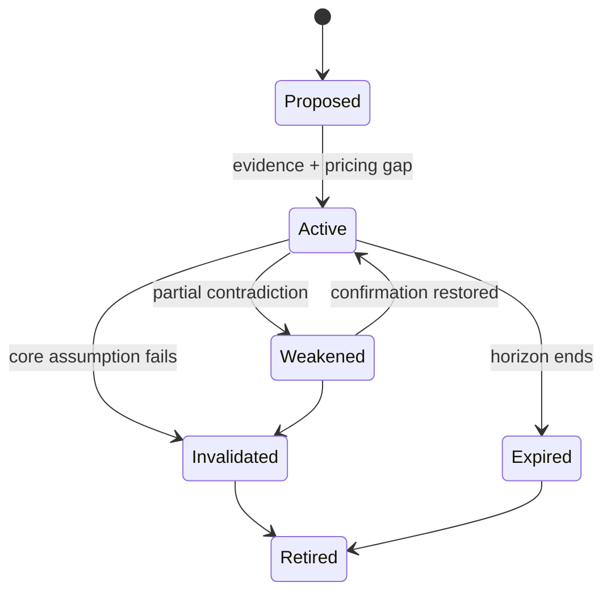

# Thesis Lifecycle and Change Control

> [!abstract] Research mandate
> Construct a point-in-time, source-controlled, model-aware and falsifiable understanding of **Thesis Lifecycle and Change Control**. Canonical doctrine is linked; this note contains the topic-specific research object.

## Definition and economic object

**Thesis Lifecycle and Change Control** is a research object inside the institutional research process, its roles, information boundaries, controls, and decision handoffs. The analyst must isolate the measurable state, the expectation already embedded in prices, the mechanism connecting them, and the horizon on which that inference can survive.

For **Thesis Lifecycle and Change Control**, the relevant institutional domain is **orientation**: the institutional research process, its roles, information boundaries, controls, and decision handoffs. Classify every input as observation, derived measurement, model estimate, market-implied estimate, forecast, causal claim, scenario assumption, judgment, or decision rule.

## Research questions

1. What exact state or mechanism does **Thesis Lifecycle and Change Control** represent, in what unit, population, instrument, and convention?
2. Which **Thesis Lifecycle and Change Control** observations existed at the decision cutoff, which are estimates, and which are revised?
3. What distribution about **Thesis Lifecycle and Change Control** is embedded in consensus, curves, options, valuation, positioning, or physical basis?
4. Which market or variable must lead if the proposed **Thesis Lifecycle and Change Control** mechanism is active?
5. What rival model can create the same target move while **Thesis Lifecycle and Change Control** is unchanged?
6. How do regime, horizon, positioning, liquidity, carry, and implementation alter the payoff?
7. Which predeclared evidence rejects, caps, or expires the **Thesis Lifecycle and Change Control** decision?

## Identities and model skeleton

$$
DecisionQuality=f(Evidence,Calibration,Process,Execution,Governance)
$$

$$
Utility(a)=\sum_s P(s|\mathcal I_t)U(a,s)
$$

For **Thesis Lifecycle and Change Control**, document every variable, unit, convention, sample, parameter, regularizer, and uncertainty estimate. An identity constrains possible stories; it does not estimate an elasticity or prove a causal channel.

## Measurement architecture

- **Measurement 1 for Thesis Lifecycle and Change Control:** research question and decision owner.
- **Measurement 2 for Thesis Lifecycle and Change Control:** information timestamp and evidence status.
- **Measurement 3 for Thesis Lifecycle and Change Control:** forecast distribution and priced baseline.
- **Measurement 4 for Thesis Lifecycle and Change Control:** permission, risk budget, veto, and expiry.
- **Measurement 5 for Thesis Lifecycle and Change Control:** decision record, attribution, and model-change history.

The **Thesis Lifecycle and Change Control** dataset must satisfy [[00 Core Standards/16 Data Dictionary and Release Calendar Standard]] and preserve first releases, revisions, and admissible timestamps under [[00 Core Standards/03 Point-in-Time and Bitemporal Data Standard]].

## Estimation and validation stack

- **Model layer 1 for Thesis Lifecycle and Change Control:** decision decomposition.
- **Model layer 2 for Thesis Lifecycle and Change Control:** pre-mortem and red-team review.
- **Model layer 3 for Thesis Lifecycle and Change Control:** claim–evidence matrices.
- **Model layer 4 for Thesis Lifecycle and Change Control:** calibration scoring.
- **Model layer 5 for Thesis Lifecycle and Change Control:** process attribution and control testing.

Validate the **Thesis Lifecycle and Change Control** stack against simple point-in-time benchmarks. Report forecast/density error, probability calibration, regime stability, vintage sensitivity, feature ablation, latency, cost, and economic value. Register implementation under [[00 Core Standards/14 Model Card Standard]].

## Multihorizon behavior

| Horizon | Topic-specific role |
|---|---|
| Structural | In the **Thesis Lifecycle and Change Control** research object, institutional mandate, incentives, and architecture remain valid until governance or strategy changes. |
| Cyclical | In the **Thesis Lifecycle and Change Control** research object, resource allocation and model priorities adapt to the current macro regime. |
| Tactical | In the **Thesis Lifecycle and Change Control** research object, committee cadence, escalation, and evidence thresholds respond to catalyst density. |
| Daily/Event | In the **Thesis Lifecycle and Change Control** research object, decision ownership, cutoff times, and vetoes must be explicit before risk is taken. |

Conflicts involving **Thesis Lifecycle and Change Control** must retain separate state objects and be resolved through [[00 Core Standards/04 Multihorizon Inheritance and Conflict Resolution]], never by an undocumented average score.

## Causal transmission

1. **Thesis Lifecycle and Change Control channel 1:** test `research object → committee interpretation`.
2. **Thesis Lifecycle and Change Control channel 2:** test `committee interpretation → portfolio permission`.
3. **Thesis Lifecycle and Change Control channel 3:** test `permission → execution mandate`.
4. **Thesis Lifecycle and Change Control channel 4:** test `outcome → attribution and learning`.

**Thesis Lifecycle and Change Control asset translation:** Process: decision rights, cutoff, veto, and auditability are part of the edge. Predeclare the leader. If the target moves without the leader or with contradictory independent evidence, reduce the **Thesis Lifecycle and Change Control** posterior or activate a rival explanation.

## Fundamental decision application

- Intraday governance: [[00 Core Standards/19 Fundamental-Only Research Boundary and Implementation Standard]]

## Multi-day decision application

- Multi-day governance: [[00 Core Standards/04 Multihorizon Inheritance and Conflict Resolution]]

## Falsification and known failure modes

- **Failure test 1 for Thesis Lifecycle and Change Control:** storytelling without a decision object.
- **Failure test 2 for Thesis Lifecycle and Change Control:** authority replacing evidence.
- **Failure test 3 for Thesis Lifecycle and Change Control:** hindsight contamination.
- **Failure test 4 for Thesis Lifecycle and Change Control:** unclear ownership.
- **Failure test 5 for Thesis Lifecycle and Change Control:** process bloat that delays time-sensitive decisions.

Score **Thesis Lifecycle and Change Control** separately for state estimation, expectation measurement, causal transmission, expression, timing, sizing, execution, and residual noise. Neither a winning outcome nor a losing outcome alone establishes research quality.

## Required research record

- Schema: [[00 Core Standards/17 Context Object and Permission Schema Standard]]

## Preserved subject-specific foundation

This material survived consolidation because it contains subject-specific instruction for **Thesis Lifecycle and Change Control**, not the former repeated institutional wrapper.

A thesis must have an identity, evidence set, version, horizon, and retirement condition. Otherwise it becomes an unfalsifiable story.

## Thesis Object

```yaml
thesis_id:
version: 3.0.0
asset:
horizon:
claim:
state_assumptions:
priced_baseline:
pricing_gap:
transmission_chain:
confirmations:
invalidations:
catalysts:
permission:
confidence:
expiry:
status: proposed | active | weakened | invalidated | expired | retired
```

## Lifecycle



## Material Change Test

Create a new thesis version only when one of these changes:

- core state assumption;
- priced baseline;
- dominant transmission channel;
- expected horizon;
- explicit invalidation;
- trade permission;
- confidence category.

Do not version the thesis for normal price noise.

## Evidence Ledger

Every evidence item should be tagged:

- supportive / contradictory / neutral;
- leading / coincident / lagging;
- high / medium / low reliability;
- structural / cyclical / tactical / intraday;
- independent / derivative / duplicate;
- expected / surprising.

Duplicate evidence must not be counted as independent confirmation. For example, several equity indices responding to the same rate move may represent one underlying signal.

## Expiry versus Invalidation

- **Invalidation:** the causal claim becomes false.
- **Expiry:** the claim may still be true but is no longer actionable for the selected horizon.
- **Stop-out:** the implementation failed or the risk limit was reached; this does not automatically invalidate the macro thesis.
- **Target hit:** the trade succeeded; this does not prove the thesis.

## Governance Rules

1. Never edit an invalidation after it is triggered.
2. Never convert an intraday thesis into a swing thesis after loss.
3. Never increase confidence solely because price moves in the desired direction.
4. Record why a thesis was changed before seeing the final outcome.
5. Retain failed theses for model evaluation.
6. Distinguish evidence discovered before and after the trade.
7. A thesis without an expiry cannot grant trade permission.

## Thesis Quality Gate

A thesis cannot become active unless it answers:

- What is the claim?
- Relative to what market expectation?
- Through which channel?
- Why this asset?
- Why now?
- What confirms it?
- What falsifies it?
- When does it expire?

---

## Primary source routes for Thesis Lifecycle and Change Control

- [[65 Source Registry and Claim Lineage/BIS — Bank for International Settlements]]
- [[65 Source Registry and Claim Lineage/IMF_GFSR — IMF Global Financial Stability Report]]
- [[65 Source Registry and Claim Lineage/FED_FSR — Federal Reserve — Financial Stability Report]]
- [[65 Source Registry and Claim Lineage/IOSCO — International Organization of Securities Commissions]]

## Canonical controls

- [[00 Core Standards/01 Research Object and Decision Contract]]
- [[00 Core Standards/02 Evidence Source Lineage and Claim Types]]
- [[00 Core Standards/06 Causal Identification and Rival Models]]
- [[00 Core Standards/07 Permission Proof and Incremental Edge]]
- [[00 Core Standards/09 Portfolio Liquidity and Implementation Governance]]
