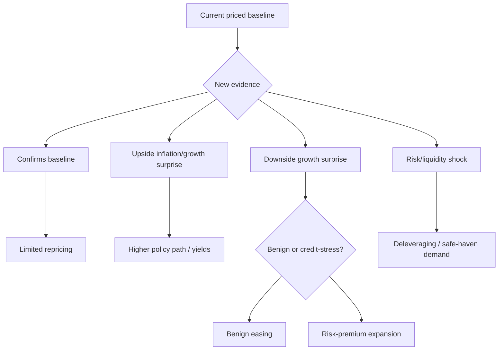

# Scenario Construction

> [!abstract] Research mandate
> Construct a point-in-time, source-controlled, model-aware and falsifiable understanding of **Scenario Construction**. Canonical doctrine is linked; this note contains the topic-specific research object.

## Definition and economic object

**Scenario Construction** is a research object inside the institutional research process, its roles, information boundaries, controls, and decision handoffs. The analyst must isolate the measurable state, the expectation already embedded in prices, the mechanism connecting them, and the horizon on which that inference can survive.

For **Scenario Construction**, the relevant institutional domain is **orientation**: the institutional research process, its roles, information boundaries, controls, and decision handoffs. Classify every input as observation, derived measurement, model estimate, market-implied estimate, forecast, causal claim, scenario assumption, judgment, or decision rule.

## Research questions

1. What exact state or mechanism does **Scenario Construction** represent, in what unit, population, instrument, and convention?
2. Which **Scenario Construction** observations existed at the decision cutoff, which are estimates, and which are revised?
3. What distribution about **Scenario Construction** is embedded in consensus, curves, options, valuation, positioning, or physical basis?
4. Which market or variable must lead if the proposed **Scenario Construction** mechanism is active?
5. What rival model can create the same target move while **Scenario Construction** is unchanged?
6. How do regime, horizon, positioning, liquidity, carry, and implementation alter the payoff?
7. Which predeclared evidence rejects, caps, or expires the **Scenario Construction** decision?

## Identities and model skeleton

$$
DecisionQuality=f(Evidence,Calibration,Process,Execution,Governance)
$$

$$
Utility(a)=\sum_s P(s|\mathcal I_t)U(a,s)
$$

For **Scenario Construction**, document every variable, unit, convention, sample, parameter, regularizer, and uncertainty estimate. An identity constrains possible stories; it does not estimate an elasticity or prove a causal channel.

## Measurement architecture

- **Measurement 1 for Scenario Construction:** research question and decision owner.
- **Measurement 2 for Scenario Construction:** information timestamp and evidence status.
- **Measurement 3 for Scenario Construction:** forecast distribution and priced baseline.
- **Measurement 4 for Scenario Construction:** permission, risk budget, veto, and expiry.
- **Measurement 5 for Scenario Construction:** decision record, attribution, and model-change history.

The **Scenario Construction** dataset must satisfy [[00 Core Standards/16 Data Dictionary and Release Calendar Standard]] and preserve first releases, revisions, and admissible timestamps under [[00 Core Standards/03 Point-in-Time and Bitemporal Data Standard]].

## Estimation and validation stack

- **Model layer 1 for Scenario Construction:** decision decomposition.
- **Model layer 2 for Scenario Construction:** pre-mortem and red-team review.
- **Model layer 3 for Scenario Construction:** claim–evidence matrices.
- **Model layer 4 for Scenario Construction:** calibration scoring.
- **Model layer 5 for Scenario Construction:** process attribution and control testing.

Validate the **Scenario Construction** stack against simple point-in-time benchmarks. Report forecast/density error, probability calibration, regime stability, vintage sensitivity, feature ablation, latency, cost, and economic value. Register implementation under [[00 Core Standards/14 Model Card Standard]].

## Multihorizon behavior

| Horizon | Topic-specific role |
|---|---|
| Structural | In the **Scenario Construction** research object, institutional mandate, incentives, and architecture remain valid until governance or strategy changes. |
| Cyclical | In the **Scenario Construction** research object, resource allocation and model priorities adapt to the current macro regime. |
| Tactical | In the **Scenario Construction** research object, committee cadence, escalation, and evidence thresholds respond to catalyst density. |
| Daily/Event | In the **Scenario Construction** research object, decision ownership, cutoff times, and vetoes must be explicit before risk is taken. |

Conflicts involving **Scenario Construction** must retain separate state objects and be resolved through [[00 Core Standards/04 Multihorizon Inheritance and Conflict Resolution]], never by an undocumented average score.

## Causal transmission

1. **Scenario Construction channel 1:** test `research object → committee interpretation`.
2. **Scenario Construction channel 2:** test `committee interpretation → portfolio permission`.
3. **Scenario Construction channel 3:** test `permission → execution mandate`.
4. **Scenario Construction channel 4:** test `outcome → attribution and learning`.

**Scenario Construction asset translation:** Process: decision rights, cutoff, veto, and auditability are part of the edge. Predeclare the leader. If the target moves without the leader or with contradictory independent evidence, reduce the **Scenario Construction** posterior or activate a rival explanation.

## Fundamental decision application

- Intraday governance: [[00 Core Standards/19 Fundamental-Only Research Boundary and Implementation Standard]]

## Multi-day decision application

- Multi-day governance: [[00 Core Standards/04 Multihorizon Inheritance and Conflict Resolution]]

## Falsification and known failure modes

- **Failure test 1 for Scenario Construction:** storytelling without a decision object.
- **Failure test 2 for Scenario Construction:** authority replacing evidence.
- **Failure test 3 for Scenario Construction:** hindsight contamination.
- **Failure test 4 for Scenario Construction:** unclear ownership.
- **Failure test 5 for Scenario Construction:** process bloat that delays time-sensitive decisions.

Score **Scenario Construction** separately for state estimation, expectation measurement, causal transmission, expression, timing, sizing, execution, and residual noise. Neither a winning outcome nor a losing outcome alone establishes research quality.

## Required research record

- Schema: [[00 Core Standards/17 Context Object and Permission Schema Standard]]

## Preserved subject-specific foundation

This material survived consolidation because it contains subject-specific instruction for **Scenario Construction**, not the former repeated institutional wrapper.

Scenarios are conditional causal models. They are not decorative bull/base/bear price targets.

## Scenario Anatomy

Every scenario needs:

1. **Trigger** — what changes?
2. **State implication** — what does it say about growth, inflation, policy, liquidity, or risk?
3. **Expectation change** — what must the market reprice?
4. **Transmission** — which rates, FX, credit, earnings, or commodity channels carry it?
5. **Asset behavior** — what should outperform/underperform?
6. **Confirmation** — what observable markets validate it?
7. **Invalidation** — what makes it wrong?
8. **Horizon** — how long should it matter?

## Scenario Tree



## Orthogonal Scenarios

Scenarios should differ by causal mechanism, not merely by price direction.

Weak design:
- bullish;
- sideways;
- bearish.

Strong design:
- disinflation with resilient growth;
- inflation reacceleration;
- benign growth slowdown with credible easing;
- growth/credit break;
- supply shock;
- liquidity/positioning accident.

## Probability Discipline

Use broad ranges and update them with evidence:

\[
P(H_i|D) \propto P(D|H_i)P(H_i)
\]

Do not confuse:
- scenario probability;
- trade win probability;
- expected return;
- confidence in data quality.

A low-probability scenario can dominate risk if its payoff or loss is nonlinear.

## Scenario-to-Asset Matrix

| Scenario | Front-end rates | 10Y real yield | USD | Credit | NQ | ES | Gold | Oil |
|---|---|---|---|---|---|---|---|---|
| Benign disinflation | Down | Down/stable | Softer | Stable | Positive | Positive | Positive | Mixed |
| Inflation reacceleration | Up | Up | Firmer | Wider risk | Negative | Negative/mixed | Initially negative, regime-dependent | Positive if supply-led |
| Benign slowdown | Down | Down | Mixed | Stable | Positive after repricing | Mixed-positive | Positive | Negative |
| Credit break | Down eventually | Down | Often firmer initially | Wider sharply | Negative | Negative | Mixed then positive | Negative |
| Supply shock | Up | Mixed | Mixed | Wider | Negative | Negative | Positive/mixed | Positive |

This matrix is a starting hypothesis, not a permanent law. Always apply 06 Regime Dependence.

## Trigger Thresholds

Write thresholds before the event:

- what component must surprise;
- how large relative to recent volatility;
- whether revisions matter;
- which rate move confirms;
- how long confirmation should persist;
- what price response would contradict the interpretation.

## Scenario Collision

More than one scenario can operate:

- a supply shock raises oil and inflation expectations;
- simultaneously growth expectations weaken;
- policy may become constrained;
- equities face both discount-rate and cash-flow pressure.

When scenarios collide, reduce confidence and favor the asset with the cleanest direct exposure.

## Scenario Update Log

```yaml
scenario:
prior_probability:
new_evidence:
likelihood_under_scenario:
posterior_range:
pricing_already_adjusted:
permission_effect:
```

---

## Primary source routes for Scenario Construction

- [[65 Source Registry and Claim Lineage/BIS — Bank for International Settlements]]
- [[65 Source Registry and Claim Lineage/IMF_GFSR — IMF Global Financial Stability Report]]
- [[65 Source Registry and Claim Lineage/FED_FSR — Federal Reserve — Financial Stability Report]]
- [[65 Source Registry and Claim Lineage/IOSCO — International Organization of Securities Commissions]]

## Canonical controls

- [[00 Core Standards/01 Research Object and Decision Contract]]
- [[00 Core Standards/02 Evidence Source Lineage and Claim Types]]
- [[00 Core Standards/06 Causal Identification and Rival Models]]
- [[00 Core Standards/07 Permission Proof and Incremental Edge]]
- [[00 Core Standards/09 Portfolio Liquidity and Implementation Governance]]
