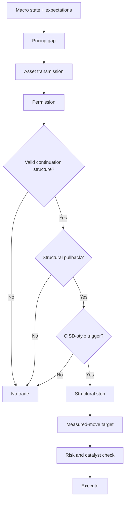

# Integration with the Trend-Pullback-CISD Strategy

> [!abstract] Research mandate
> Construct a point-in-time, source-controlled, model-aware and falsifiable understanding of **Integration with the Trend-Pullback-CISD Strategy**. Canonical doctrine is linked; this note contains the topic-specific research object.

## Definition and economic object

**Integration with the Trend-Pullback-CISD Strategy** is a research object inside the institutional research process, its roles, information boundaries, controls, and decision handoffs. The analyst must isolate the measurable state, the expectation already embedded in prices, the mechanism connecting them, and the horizon on which that inference can survive.

For **Integration with the Trend-Pullback-CISD Strategy**, the relevant institutional domain is **orientation**: the institutional research process, its roles, information boundaries, controls, and decision handoffs. Classify every input as observation, derived measurement, model estimate, market-implied estimate, forecast, causal claim, scenario assumption, judgment, or decision rule.

## Research questions

1. What exact state or mechanism does **Integration with the Trend-Pullback-CISD Strategy** represent, in what unit, population, instrument, and convention?
2. Which **Integration with the Trend-Pullback-CISD Strategy** observations existed at the decision cutoff, which are estimates, and which are revised?
3. What distribution about **Integration with the Trend-Pullback-CISD Strategy** is embedded in consensus, curves, options, valuation, positioning, or physical basis?
4. Which market or variable must lead if the proposed **Integration with the Trend-Pullback-CISD Strategy** mechanism is active?
5. What rival model can create the same target move while **Integration with the Trend-Pullback-CISD Strategy** is unchanged?
6. How do regime, horizon, positioning, liquidity, carry, and implementation alter the payoff?
7. Which predeclared evidence rejects, caps, or expires the **Integration with the Trend-Pullback-CISD Strategy** decision?

## Identities and model skeleton

$$
DecisionQuality=f(Evidence,Calibration,Process,Execution,Governance)
$$

$$
Utility(a)=\sum_s P(s|\mathcal I_t)U(a,s)
$$

For **Integration with the Trend-Pullback-CISD Strategy**, document every variable, unit, convention, sample, parameter, regularizer, and uncertainty estimate. An identity constrains possible stories; it does not estimate an elasticity or prove a causal channel.

## Measurement architecture

- **Measurement 1 for Integration with the Trend-Pullback-CISD Strategy:** research question and decision owner.
- **Measurement 2 for Integration with the Trend-Pullback-CISD Strategy:** information timestamp and evidence status.
- **Measurement 3 for Integration with the Trend-Pullback-CISD Strategy:** forecast distribution and priced baseline.
- **Measurement 4 for Integration with the Trend-Pullback-CISD Strategy:** permission, risk budget, veto, and expiry.
- **Measurement 5 for Integration with the Trend-Pullback-CISD Strategy:** decision record, attribution, and model-change history.

The **Integration with the Trend-Pullback-CISD Strategy** dataset must satisfy [[00 Core Standards/16 Data Dictionary and Release Calendar Standard]] and preserve first releases, revisions, and admissible timestamps under [[00 Core Standards/03 Point-in-Time and Bitemporal Data Standard]].

## Estimation and validation stack

- **Model layer 1 for Integration with the Trend-Pullback-CISD Strategy:** decision decomposition.
- **Model layer 2 for Integration with the Trend-Pullback-CISD Strategy:** pre-mortem and red-team review.
- **Model layer 3 for Integration with the Trend-Pullback-CISD Strategy:** claim–evidence matrices.
- **Model layer 4 for Integration with the Trend-Pullback-CISD Strategy:** calibration scoring.
- **Model layer 5 for Integration with the Trend-Pullback-CISD Strategy:** process attribution and control testing.

Validate the **Integration with the Trend-Pullback-CISD Strategy** stack against simple point-in-time benchmarks. Report forecast/density error, probability calibration, regime stability, vintage sensitivity, feature ablation, latency, cost, and economic value. Register implementation under [[00 Core Standards/14 Model Card Standard]].

## Multihorizon behavior

| Horizon | Topic-specific role |
|---|---|
| Structural | In the **Integration with the Trend-Pullback-CISD Strategy** research object, institutional mandate, incentives, and architecture remain valid until governance or strategy changes. |
| Cyclical | In the **Integration with the Trend-Pullback-CISD Strategy** research object, resource allocation and model priorities adapt to the current macro regime. |
| Tactical | In the **Integration with the Trend-Pullback-CISD Strategy** research object, committee cadence, escalation, and evidence thresholds respond to catalyst density. |
| Daily/Event | In the **Integration with the Trend-Pullback-CISD Strategy** research object, decision ownership, cutoff times, and vetoes must be explicit before risk is taken. |

Conflicts involving **Integration with the Trend-Pullback-CISD Strategy** must retain separate state objects and be resolved through [[00 Core Standards/04 Multihorizon Inheritance and Conflict Resolution]], never by an undocumented average score.

## Causal transmission

1. **Integration with the Trend-Pullback-CISD Strategy channel 1:** test `research object → committee interpretation`.
2. **Integration with the Trend-Pullback-CISD Strategy channel 2:** test `committee interpretation → portfolio permission`.
3. **Integration with the Trend-Pullback-CISD Strategy channel 3:** test `permission → execution mandate`.
4. **Integration with the Trend-Pullback-CISD Strategy channel 4:** test `outcome → attribution and learning`.

**Integration with the Trend-Pullback-CISD Strategy asset translation:** Process: decision rights, cutoff, veto, and auditability are part of the edge. Predeclare the leader. If the target moves without the leader or with contradictory independent evidence, reduce the **Integration with the Trend-Pullback-CISD Strategy** posterior or activate a rival explanation.

## Day-trading decision translation

- Identify the new **Integration with the Trend-Pullback-CISD Strategy** information since the prior close and its source timestamp.
- Reconstruct the priced **Integration with the Trend-Pullback-CISD Strategy** baseline before reading the target move.
- Name the liquid leader closest to the **Integration with the Trend-Pullback-CISD Strategy** mechanism and one independent confirmation.
- Compare observed transmission with the **Integration with the Trend-Pullback-CISD Strategy** event/quiet-day historical distribution.
- Assign a permission and a confidence cap; record the **Integration with the Trend-Pullback-CISD Strategy** cancellation condition.
- Pass only the permission, leader, invalidation, expiry, and size ceiling to technical execution.

For **Integration with the Trend-Pullback-CISD Strategy**, fundamentals restrict the allowed trade set; they do not supply the candle trigger or authorize widening a structural stop.

## Two-to-ten-day swing translation

- Define the still-open **Integration with the Trend-Pullback-CISD Strategy** pricing gap rather than the general narrative.
- Estimate the **Integration with the Trend-Pullback-CISD Strategy** impulse half-life and its uncertainty by regime.
- Map catalysts capable of confirming, reversing, or exhausting the **Integration with the Trend-Pullback-CISD Strategy** campaign.
- Compare outright and relative expressions for carry, convexity, gap, liquidity, and factor purity.
- Specify terminal realization, time expiry, and evidence-based invalidation for **Integration with the Trend-Pullback-CISD Strategy**.

A valid **Integration with the Trend-Pullback-CISD Strategy** thesis with no residual pricing gap, adverse carry beyond expected payoff, or an imminent dominating catalyst is not a deployable swing.

## Falsification and known failure modes

- **Failure test 1 for Integration with the Trend-Pullback-CISD Strategy:** storytelling without a decision object.
- **Failure test 2 for Integration with the Trend-Pullback-CISD Strategy:** authority replacing evidence.
- **Failure test 3 for Integration with the Trend-Pullback-CISD Strategy:** hindsight contamination.
- **Failure test 4 for Integration with the Trend-Pullback-CISD Strategy:** unclear ownership.
- **Failure test 5 for Integration with the Trend-Pullback-CISD Strategy:** process bloat that delays time-sensitive decisions.

Score **Integration with the Trend-Pullback-CISD Strategy** separately for state estimation, expectation measurement, causal transmission, expression, timing, sizing, execution, and residual noise. Neither a winning outcome nor a losing outcome alone establishes research quality.

## Required implementation record

Create a context object under [[00 Core Standards/17 Context Object and Permission Schema Standard]] containing the **Integration with the Trend-Pullback-CISD Strategy** target, cutoff, data vintages, model version, state/market distributions, rival models, leader, confirmations, horizon, half-life, permission, confidence cap, size ceiling, invalidation, technical handoff, expiry, and claim IDs.

## Preserved subject-specific foundation

This material survived consolidation because it contains subject-specific instruction for **Integration with the Trend-Pullback-CISD Strategy**, not the former repeated institutional wrapper.

This note defines the boundary between **fundamental context** and Amir's **Trend Continuation + Structural Pullback + CISD Trigger + Structural Invalidation + Measured-Move Target** execution model.

## Separation of Authority

| Component | Authority |
|---|---|
| Fundamental/macro OS | Directional permission, timing context, vetoes |
| Market structure | Whether continuation exists |
| Pullback logic | Entry location |
| CISD-style trigger | Entry timing |
| Structural invalidation | Stop placement |
| Measured move / symmetry | Objective |
| Risk system | Position size and portfolio cap |

Fundamentals do not choose the exact entry. Technicals do not invent the macro regime.

## End-to-End Protocol



## Permission Behavior

### `LONG_ONLY`
- Ignore technically valid short continuation setups.
- Take longs only when the complete setup appears.
- No obligation to buy.

### `SHORT_ONLY`
- Ignore technically valid long continuation setups.
- Take shorts only when the complete setup appears.

### `TWO_WAY_REDUCED`
- Both directions are eligible.
- Risk is reduced.
- Technical quality threshold increases.
- Prefer the direction confirmed by rates/USD/breadth during the session.

### `NO_TRADE`
- No setup can override the veto.

## Fundamental Context Card for the Strategy

```yaml
asset:
session:
permission:
dominant_driver:
expected_direction:
required_cross_asset_confirmation:
forbidden_window:
permission_expiry:
fundamental_invalidation:
```

## Technical Entry Contract

A trade is eligible only if all are true:

```yaml
trend_continuation_structure: true
structural_pullback_complete: true
cisd_trigger_valid: true
stop_at_structural_invalidation: true
measured_move_target_valid: true
reward_to_risk_acceptable: true
session_timing_valid: true
macro_permission_allows_direction: true
no_veto_active: true
```

## How Context Improves the Model

It can:

- filter structurally inferior counter-direction trades;
- distinguish benign from adverse rate declines;
- avoid entering before a regime-changing catalyst;
- select NQ versus ES based on duration/cyclicality;
- identify when Gold or USD offers a cleaner expression;
- reduce risk when cross-asset confirmation is weak;
- extend a setup from intraday to short swing only when the thesis and catalyst path support it.

It cannot:

- guarantee the next candle;
- eliminate stop-outs;
- justify early entry;
- justify stop widening;
- turn an invalid trigger into a valid one;
- rescue a failed trade through narrative.

## Day-Trade Use

For day trading, require a **today-relevant transmission channel**. A six-month macro view is background only unless it is actively repricing.

Examples of today-relevant channels:

- rate response to data;
- dollar response to policy expectations;
- index leadership after earnings;
- oil response to inventory/physical evidence;
- volatility and dealer/expiry conditions;
- auction-induced rate move;
- unscheduled policy/geopolitical shock.

## Swing Use

For a two-to-ten-day hold, require:

- persistent pricing gap;
- catalyst path that does not invalidate the trade;
- daily cross-asset confirmation;
- no hidden correlated exposure;
- explicit overnight/gap risk;
- technical structure that supports wider temporal noise.

## Conflict Rule

When fundamentals and technicals disagree:

- **Fundamental direction allowed, technical setup absent:** no trade.
- **Technical setup valid, fundamental direction forbidden:** no trade.
- **Technical trade stopped, fundamental thesis intact:** exit; reassess and wait for a new setup.
- **Fundamental thesis invalidated, trade still technically valid:** reduce/exit according to predeclared governance; never create a new rationale.

## Evaluation

Track four groups:

1. trades taken with aligned permission;
2. setups skipped due to direction filter;
3. trades during `TWO_WAY_REDUCED`;
4. sessions marked `NO_TRADE`.

The filter earns its place only if it improves expectancy, drawdown, or decision stability out of sample.

---

## Primary source routes for Integration with the Trend-Pullback-CISD Strategy

- [[65 Source Registry and Claim Lineage/BIS — Bank for International Settlements]]
- [[65 Source Registry and Claim Lineage/IMF_GFSR — IMF Global Financial Stability Report]]
- [[65 Source Registry and Claim Lineage/FED_FSR — Federal Reserve — Financial Stability Report]]
- [[65 Source Registry and Claim Lineage/IOSCO — International Organization of Securities Commissions]]

## Canonical controls

- [[00 Core Standards/01 Research Object and Decision Contract]]
- [[00 Core Standards/02 Evidence Source Lineage and Claim Types]]
- [[00 Core Standards/06 Causal Identification and Rival Models]]
- [[00 Core Standards/07 Permission Proof and Incremental Edge]]
- [[00 Core Standards/09 Portfolio Liquidity and Execution Handoff]]
