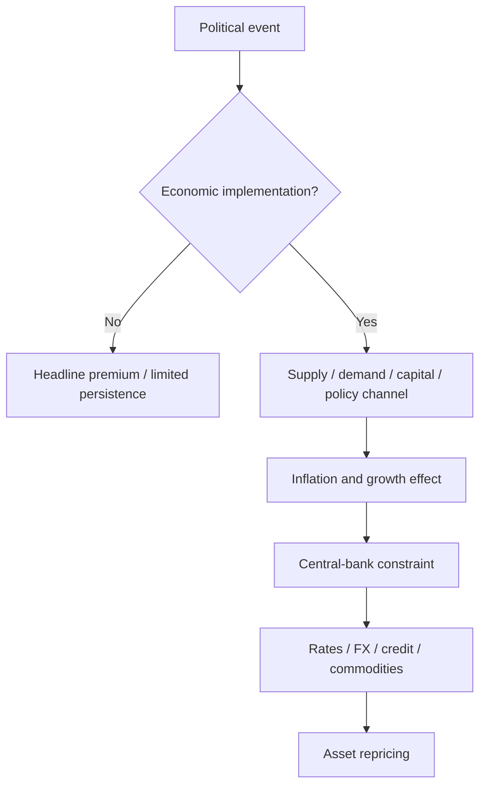

# Geopolitical Shock Protocol

> [!abstract] Research mandate
> Construct a point-in-time, source-controlled, model-aware and falsifiable understanding of **Geopolitical Shock Protocol**. Canonical doctrine is linked; this note contains the topic-specific research object.

## Definition and economic object

**Geopolitical Shock Protocol** is a research object inside conversion of macro information into horizon-specific permissions, scenario paths, implementation handoffs, and auditable trade management. The analyst must isolate the measurable state, the expectation already embedded in prices, the mechanism connecting them, and the horizon on which that inference can survive.

For **Geopolitical Shock Protocol**, the relevant institutional domain is **trading**: conversion of macro information into horizon-specific permissions, scenario paths, implementation handoffs, and auditable trade management. Classify every input as observation, derived measurement, model estimate, market-implied estimate, forecast, causal claim, scenario assumption, judgment, or decision rule.

## Research questions

1. What exact state or mechanism does **Geopolitical Shock Protocol** represent, in what unit, population, instrument, and convention?
2. Which **Geopolitical Shock Protocol** observations existed at the decision cutoff, which are estimates, and which are revised?
3. What distribution about **Geopolitical Shock Protocol** is embedded in consensus, curves, options, valuation, positioning, or physical basis?
4. Which market or variable must lead if the proposed **Geopolitical Shock Protocol** mechanism is active?
5. What rival model can create the same target move while **Geopolitical Shock Protocol** is unchanged?
6. How do regime, horizon, positioning, liquidity, carry, and implementation alter the payoff?
7. Which predeclared evidence rejects, caps, or expires the **Geopolitical Shock Protocol** decision?

## Identities and model skeleton

$$
Edge(a,h)=\sum_s[P_{desk}(s)-P_{mkt}(s)]Payoff(a,s,h)-Cost(a,h)
$$

$$
Permission\in\{LONG\_ONLY,SHORT\_ONLY,TWO\_WAY\_REDUCED,NO\_TRADE\}
$$

For **Geopolitical Shock Protocol**, document every variable, unit, convention, sample, parameter, regularizer, and uncertainty estimate. An identity constrains possible stories; it does not estimate an elasticity or prove a causal channel.

## Measurement architecture

- **Measurement 1 for Geopolitical Shock Protocol:** inherited higher-horizon state.
- **Measurement 2 for Geopolitical Shock Protocol:** new information and priced baseline.
- **Measurement 3 for Geopolitical Shock Protocol:** causal leader and independent confirmation.
- **Measurement 4 for Geopolitical Shock Protocol:** liquidity/event clock and expected half-life.
- **Measurement 5 for Geopolitical Shock Protocol:** predeclared observable confirmation, predeclared risk limit, and expiry.

The **Geopolitical Shock Protocol** dataset must satisfy [[00 Core Standards/16 Data Dictionary and Release Calendar Standard]] and preserve first releases, revisions, and admissible timestamps under [[00 Core Standards/03 Point-in-Time and Bitemporal Data Standard]].

## Estimation and validation stack

- **Model layer 1 for Geopolitical Shock Protocol:** scenario trees.
- **Model layer 2 for Geopolitical Shock Protocol:** event studies.
- **Model layer 3 for Geopolitical Shock Protocol:** cross-asset confirmation matrices.
- **Model layer 4 for Geopolitical Shock Protocol:** permission classification.
- **Model layer 5 for Geopolitical Shock Protocol:** post-trade causal attribution.

Validate the **Geopolitical Shock Protocol** stack against simple point-in-time benchmarks. Report forecast/density error, probability calibration, regime stability, vintage sensitivity, feature ablation, latency, cost, and economic value. Register implementation under [[00 Core Standards/14 Model Card Standard]].

## Multihorizon behavior

| Horizon | Topic-specific role |
|---|---|
| Structural/Cyclical | In the **Geopolitical Shock Protocol** research object, higher-horizon states create priors but do not time entries. |
| Tactical/Swing | In the **Geopolitical Shock Protocol** research object, repricing path, catalysts, and half-life determine campaign permission. |
| Daily | In the **Geopolitical Shock Protocol** research object, overnight change and current pricing produce one of four permission states. |
| Event/Intraday | In the **Geopolitical Shock Protocol** research object, leader, confirmation, liquidity, and observable market-state confirmation govern execution. |

Conflicts involving **Geopolitical Shock Protocol** must retain separate state objects and be resolved through [[00 Core Standards/04 Multihorizon Inheritance and Conflict Resolution]], never by an undocumented average score.

## Causal transmission

1. **Geopolitical Shock Protocol channel 1:** test `information gap → leader repricing`.
2. **Geopolitical Shock Protocol channel 2:** test `leader → target asset`.
3. **Geopolitical Shock Protocol channel 3:** test `positioning/liquidity → path shape`.
4. **Geopolitical Shock Protocol channel 4:** test `observable market-state confirmation → executable risk definition`.

**Geopolitical Shock Protocol asset translation:** Trading: fundamentals grant permission; the observable market-state confirmation controls instrument selection, risk budget, and exit conditions. Predeclare the leader. If the target moves without the leader or with contradictory independent evidence, reduce the **Geopolitical Shock Protocol** posterior or activate a rival explanation.

## Fundamental decision application

- Intraday governance: [[00 Core Standards/19 Fundamental-Only Research Boundary and Implementation Standard]]

## Multi-day decision application

- Multi-day governance: [[00 Core Standards/04 Multihorizon Inheritance and Conflict Resolution]]

## Falsification and known failure modes

- **Failure test 1 for Geopolitical Shock Protocol:** using fundamentals as entry timing.
- **Failure test 2 for Geopolitical Shock Protocol:** changing bias after every candle.
- **Failure test 3 for Geopolitical Shock Protocol:** confusing a correct thesis with good execution.
- **Failure test 4 for Geopolitical Shock Protocol:** holding beyond evidence half-life.
- **Failure test 5 for Geopolitical Shock Protocol:** overriding predeclared risk limits with narratives.

Score **Geopolitical Shock Protocol** separately for state estimation, expectation measurement, causal transmission, expression, timing, sizing, execution, and residual noise. Neither a winning outcome nor a losing outcome alone establishes research quality.

## Required research record

- Schema: [[00 Core Standards/17 Context Object and Permission Schema Standard]]

## Preserved subject-specific foundation

This material survived consolidation because it contains subject-specific instruction for **Geopolitical Shock Protocol**, not the former repeated institutional wrapper.

Geopolitical analysis for trading must convert events into **economic channels, probabilities, duration, and market constraints**. Moral or emotional importance is not identical to market persistence.

## Shock Classification

- military escalation;
- sanctions/export controls;
- tariffs/trade restrictions;
- energy/commodity disruption;
- shipping/logistics disruption;
- sovereign/political instability;
- election/policy discontinuity;
- cyber/infrastructure disruption;
- alliance or treaty change.

## Transmission Map

## Required Questions

1. What exactly occurred?
2. Is the source verified?
3. Is it a statement, proposal, law, action, or physical disruption?
4. What is the direct economic exposure?
5. What is the likely response?
6. What is reversible?
7. What is the duration?
8. What inventory, spare capacity, substitution, or policy buffer exists?
9. Which market is the direct transmission instrument?
10. What would demonstrate escalation or de-escalation?

## Initial Market Response

The first move often reflects:

- generic de-risking;
- liquidity withdrawal;
- stop activation;
- safe-haven demand;
- uncertainty premium.

Persistent repricing requires a durable channel.

## Asset Channels

- Oil: actual or expected barrel/logistics disruption.
- Gold: real yields, USD, trust/tail risk, physical demand.
- USD: funding/safe-haven demand and relative exposure.
- Equities: earnings, input costs, risk premium, supply chains.
- Rates: growth shock versus inflation/supply/fiscal effect.
- Credit: default and funding risk.
- FX crosses: country-specific exposure and terms of trade.

## Trading Protocol

- Default to `NO_TRADE` when facts are unverified.
- Reduce leverage because gap risk dominates.
- Use official/primary sources where possible.
- Do not chase the first spike.
- Identify the direct asset rather than forcing an index trade.
- Set explicit headline-risk expiry and overnight-risk limits.
- Update scenarios as implementation becomes clearer.

## Anti-Narrative Rule

A dramatic geopolitical thesis without a quantified economic channel is not a trading thesis.

---

## Primary source routes for Geopolitical Shock Protocol

- [[65 Source Registry and Claim Lineage/CME_FEDWATCH — CME FedWatch]]
- [[65 Source Registry and Claim Lineage/CBOE_VIX — Cboe VIX Methodology]]
- [[65 Source Registry and Claim Lineage/CFTC_COT — CFTC Commitments of Traders]]
- [[65 Source Registry and Claim Lineage/NYFED_SOFR — New York Fed — SOFR]]
- [[65 Source Registry and Claim Lineage/EIA_WPSR — EIA Weekly Petroleum Status Report]]

## Canonical controls

- [[00 Core Standards/01 Research Object and Decision Contract]]
- [[00 Core Standards/02 Evidence Source Lineage and Claim Types]]
- [[00 Core Standards/06 Causal Identification and Rival Models]]
- [[00 Core Standards/07 Permission Proof and Incremental Edge]]
- [[00 Core Standards/09 Portfolio Liquidity and Implementation Governance]]
