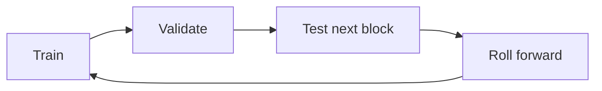

# Walk-Forward Validation

> [!abstract] Research mandate
> Construct a point-in-time, source-controlled, model-aware and falsifiable understanding of **Walk-Forward Validation**. Canonical doctrine is linked; this note contains the topic-specific research object.

## Definition and economic object

Research validation asks whether a rule would have survived real-time information, model selection, transaction costs, regime shifts, and repeated experimentation.

For **Walk-Forward Validation**, the relevant institutional domain is **nowcast**: point-in-time measurement, forecasting, causal inference, model validation, data lineage, and research deployment. Classify every input as observation, derived measurement, model estimate, market-implied estimate, forecast, causal claim, scenario assumption, judgment, or decision rule.

## Research questions

1. What exact state or mechanism does **Walk-Forward Validation** represent, in what unit, population, instrument, and convention?
2. Which **Walk-Forward Validation** observations existed at the decision cutoff, which are estimates, and which are revised?
3. What distribution about **Walk-Forward Validation** is embedded in consensus, curves, options, valuation, positioning, or physical basis?
4. Which market or variable must lead if the proposed **Walk-Forward Validation** mechanism is active?
5. What rival model can create the same target move while **Walk-Forward Validation** is unchanged?
6. How do regime, horizon, positioning, liquidity, carry, and implementation alter the payoff?
7. Which predeclared evidence rejects, caps, or expires the **Walk-Forward Validation** decision?

## Identities and model skeleton

$$
OOSLoss=\frac1N\sum_t L(y_t,\widehat y_{t|t^-})
$$

$$
DeflatedSharpe=f(SR,Skew,Kurtosis,Trials,T)
$$

$$
NetAlpha=GrossAlpha-Costs-Financing-Borrow-TaxDrag
$$

For **Walk-Forward Validation**, document every variable, unit, convention, sample, parameter, regularizer, and uncertainty estimate. An identity constrains possible stories; it does not estimate an elasticity or prove a causal channel.

## Measurement architecture

- **Measurement 1 for Walk-Forward Validation:** training/validation/test dates.
- **Measurement 2 for Walk-Forward Validation:** vintage availability.
- **Measurement 3 for Walk-Forward Validation:** hyperparameter and feature decisions.
- **Measurement 4 for Walk-Forward Validation:** number of trials and abandoned models.
- **Measurement 5 for Walk-Forward Validation:** cost, capacity, turnover, and drift.

The **Walk-Forward Validation** dataset must satisfy [[00 Core Standards/16 Data Dictionary and Release Calendar Standard]] and preserve first releases, revisions, and admissible timestamps under [[00 Core Standards/03 Point-in-Time and Bitemporal Data Standard]].

## Estimation and validation stack

- **Model layer 1 for Walk-Forward Validation:** rolling/expanding walk-forward.
- **Model layer 2 for Walk-Forward Validation:** purged and embargoed cross-validation.
- **Model layer 3 for Walk-Forward Validation:** reality-check style tests.
- **Model layer 4 for Walk-Forward Validation:** probability calibration.
- **Model layer 5 for Walk-Forward Validation:** model-change and retirement protocol.

Validate the **Walk-Forward Validation** stack against simple point-in-time benchmarks. Report forecast/density error, probability calibration, regime stability, vintage sensitivity, feature ablation, latency, cost, and economic value. Register implementation under [[00 Core Standards/14 Model Card Standard]].

## Multihorizon behavior

| Horizon | Topic-specific role |
|---|---|
| Structural | In the **Walk-Forward Validation** research object, methodology and data-generating process define model validity. |
| Cyclical | In the **Walk-Forward Validation** research object, state estimates integrate asynchronous releases and revisions. |
| Tactical/Swing | In the **Walk-Forward Validation** research object, forecast changes and confidence bands determine catalysts. |
| Daily/Event | In the **Walk-Forward Validation** research object, only information available at the timestamp may update the estimate. |

Conflicts involving **Walk-Forward Validation** must retain separate state objects and be resolved through [[00 Core Standards/04 Multihorizon Inheritance and Conflict Resolution]], never by an undocumented average score.

## Causal transmission

1. **Walk-Forward Validation channel 1:** test `raw release → vintage-controlled feature`.
2. **Walk-Forward Validation channel 2:** test `feature → state or forecast distribution`.
3. **Walk-Forward Validation channel 3:** test `distribution → pricing-gap estimate`.
4. **Walk-Forward Validation channel 4:** test `estimate → permission tested against a baseline`.

**Walk-Forward Validation asset translation:** Research: compare every model with simple real-time benchmarks and store the full forecast vintage. Predeclare the leader. If the target moves without the leader or with contradictory independent evidence, reduce the **Walk-Forward Validation** posterior or activate a rival explanation.

## Day-trading decision translation

- Identify the new **Walk-Forward Validation** information since the prior close and its source timestamp.
- Reconstruct the priced **Walk-Forward Validation** baseline before reading the target move.
- Name the liquid leader closest to the **Walk-Forward Validation** mechanism and one independent confirmation.
- Compare observed transmission with the **Walk-Forward Validation** event/quiet-day historical distribution.
- Assign a permission and a confidence cap; record the **Walk-Forward Validation** cancellation condition.
- Pass only the permission, leader, invalidation, expiry, and size ceiling to technical execution.

For **Walk-Forward Validation**, fundamentals restrict the allowed trade set; they do not supply the candle trigger or authorize widening a structural stop.

## Two-to-ten-day swing translation

- Define the still-open **Walk-Forward Validation** pricing gap rather than the general narrative.
- Estimate the **Walk-Forward Validation** impulse half-life and its uncertainty by regime.
- Map catalysts capable of confirming, reversing, or exhausting the **Walk-Forward Validation** campaign.
- Compare outright and relative expressions for carry, convexity, gap, liquidity, and factor purity.
- Specify terminal realization, time expiry, and evidence-based invalidation for **Walk-Forward Validation**.

A valid **Walk-Forward Validation** thesis with no residual pricing gap, adverse carry beyond expected payoff, or an imminent dominating catalyst is not a deployable swing.

## Falsification and known failure modes

- **Failure test 1 for Walk-Forward Validation:** random cross-validation for time series.
- **Failure test 2 for Walk-Forward Validation:** hidden test reuse.
- **Failure test 3 for Walk-Forward Validation:** survivorship bias.
- **Failure test 4 for Walk-Forward Validation:** cost-free backtests.
- **Failure test 5 for Walk-Forward Validation:** changing rules after seeing out-of-sample results.

Score **Walk-Forward Validation** separately for state estimation, expectation measurement, causal transmission, expression, timing, sizing, execution, and residual noise. Neither a winning outcome nor a losing outcome alone establishes research quality.

## Required implementation record

Create a context object under [[00 Core Standards/17 Context Object and Permission Schema Standard]] containing the **Walk-Forward Validation** target, cutoff, data vintages, model version, state/market distributions, rival models, leader, confirmations, horizon, half-life, permission, confidence cap, size ceiling, invalidation, technical handoff, expiry, and claim IDs.

## Preserved subject-specific foundation

This material survived consolidation because it contains subject-specific instruction for **Walk-Forward Validation**, not the former repeated institutional wrapper.

Macro relationships evolve. Walk-forward validation estimates whether the decision process survives time and regime change.

## Structure

Keep the final holdout untouched until model governance criteria are fixed.

## What Can Be Trained?

- thresholds;
- evidence weights;
- regime probabilities;
- permission mapping;
- confidence calibration;
- asset sensitivity;
- decay parameters.

Economic mechanism and risk rules should constrain optimization.

## Windows

Choose windows based on:

- data frequency;
- regime duration;
- number of events;
- structural breaks;
- intended adaptation speed.

Too short: unstable. Too long: stale.

## Evaluation

Report:

- expectancy;
- win/loss distribution;
- drawdown;
- tail loss;
- turnover/costs;
- permission frequency;
- no-trade frequency;
- skipped-opportunity cost;
- performance by regime;
- calibration by confidence;
- parameter stability.

## Model Selection

Select on a multi-objective basis:

- out-of-sample return quality;
- drawdown;
- simplicity;
- stability;
- causal coherence;
- operational reliability;
- low sensitivity to small threshold changes.

## Stress Tests

- crisis periods;
- rapid inflation transition;
- zero/negative-rate period;
- aggressive hiking cycle;
- liquidity shock;
- commodity shock;
- low-volatility melt-up;
- data revision clusters.

## Shadow Phase

Before live authorization:

1. run in real time;
2. freeze version;
3. record decisions before outcome;
4. compare intended and actual data availability;
5. measure operational failure;
6. approve only after sufficient diverse observations.

## Kill Criteria

Retire or reduce a model when:

- transmission relationship breaks;
- confidence loses calibration;
- performance depends on one period;
- data source changes materially;
- costs eliminate edge;
- complexity cannot be audited;
- human operators cannot apply it consistently.

---

## Primary source routes for Walk-Forward Validation

- [[65 Source Registry and Claim Lineage/ALFRED — Federal Reserve Bank of St. Louis ALFRED]]
- [[65 Source Registry and Claim Lineage/PHIL_RTDS — Philadelphia Fed — Real-Time Data Set]]
- [[65 Source Registry and Claim Lineage/CFTC_COT_NOTES — CFTC COT Explanatory Notes]]

## Canonical controls

- [[00 Core Standards/01 Research Object and Decision Contract]]
- [[00 Core Standards/02 Evidence Source Lineage and Claim Types]]
- [[00 Core Standards/06 Causal Identification and Rival Models]]
- [[00 Core Standards/07 Permission Proof and Incremental Edge]]
- [[00 Core Standards/09 Portfolio Liquidity and Execution Handoff]]
