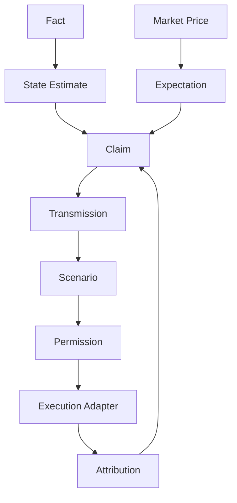

# Building the Alpha Lab Context Layer

> [!abstract] Research mandate
> Construct a point-in-time, source-controlled, model-aware and falsifiable understanding of **Building the Alpha Lab Context Layer**. Canonical doctrine is linked; this note contains the topic-specific research object.

## Definition and economic object

**Building the Alpha Lab Context Layer** is a research object inside point-in-time measurement, forecasting, causal inference, model validation, data lineage, and research deployment. The analyst must isolate the measurable state, the expectation already embedded in prices, the mechanism connecting them, and the horizon on which that inference can survive.

For **Building the Alpha Lab Context Layer**, the relevant institutional domain is **nowcast**: point-in-time measurement, forecasting, causal inference, model validation, data lineage, and research deployment. Classify every input as observation, derived measurement, model estimate, market-implied estimate, forecast, causal claim, scenario assumption, judgment, or decision rule.

## Research questions

1. What exact state or mechanism does **Building the Alpha Lab Context Layer** represent, in what unit, population, instrument, and convention?
2. Which **Building the Alpha Lab Context Layer** observations existed at the decision cutoff, which are estimates, and which are revised?
3. What distribution about **Building the Alpha Lab Context Layer** is embedded in consensus, curves, options, valuation, positioning, or physical basis?
4. Which market or variable must lead if the proposed **Building the Alpha Lab Context Layer** mechanism is active?
5. What rival model can create the same target move while **Building the Alpha Lab Context Layer** is unchanged?
6. How do regime, horizon, positioning, liquidity, carry, and implementation alter the payoff?
7. Which predeclared evidence rejects, caps, or expires the **Building the Alpha Lab Context Layer** decision?

## Identities and model skeleton

$$
\widehat y_{t|t^-}=f(\mathcal I_{t^-})
$$

$$
OOSLoss=\frac1N\sum_t L(y_t,\widehat y_{t|t^-})
$$

$$
Feature_t=g(\{x_s^{(v)}:release(s,v)\le t\})
$$

For **Building the Alpha Lab Context Layer**, document every variable, unit, convention, sample, parameter, regularizer, and uncertainty estimate. An identity constrains possible stories; it does not estimate an elasticity or prove a causal channel.

## Measurement architecture

- **Measurement 1 for Building the Alpha Lab Context Layer:** release and vintage timestamps.
- **Measurement 2 for Building the Alpha Lab Context Layer:** feature availability and missingness.
- **Measurement 3 for Building the Alpha Lab Context Layer:** forecast errors and revisions.
- **Measurement 4 for Building the Alpha Lab Context Layer:** probability calibration.
- **Measurement 5 for Building the Alpha Lab Context Layer:** drift, stability, cost, and implementation diagnostics.

The **Building the Alpha Lab Context Layer** dataset must satisfy [[00 Core Standards/16 Data Dictionary and Release Calendar Standard]] and preserve first releases, revisions, and admissible timestamps under [[00 Core Standards/03 Point-in-Time and Bitemporal Data Standard]].

## Estimation and validation stack

- **Model layer 1 for Building the Alpha Lab Context Layer:** state-space models.
- **Model layer 2 for Building the Alpha Lab Context Layer:** MIDAS and bridge equations.
- **Model layer 3 for Building the Alpha Lab Context Layer:** Bayesian VARs and local projections.
- **Model layer 4 for Building the Alpha Lab Context Layer:** panel and quasi-experimental methods.
- **Model layer 5 for Building the Alpha Lab Context Layer:** walk-forward and pseudo-real-time validation.

Validate the **Building the Alpha Lab Context Layer** stack against simple point-in-time benchmarks. Report forecast/density error, probability calibration, regime stability, vintage sensitivity, feature ablation, latency, cost, and economic value. Register implementation under [[00 Core Standards/14 Model Card Standard]].

## Multihorizon behavior

| Horizon | Topic-specific role |
|---|---|
| Structural | In the **Building the Alpha Lab Context Layer** research object, methodology and data-generating process define model validity. |
| Cyclical | In the **Building the Alpha Lab Context Layer** research object, state estimates integrate asynchronous releases and revisions. |
| Tactical/Swing | In the **Building the Alpha Lab Context Layer** research object, forecast changes and confidence bands determine catalysts. |
| Daily/Event | In the **Building the Alpha Lab Context Layer** research object, only information available at the timestamp may update the estimate. |

Conflicts involving **Building the Alpha Lab Context Layer** must retain separate state objects and be resolved through [[00 Core Standards/04 Multihorizon Inheritance and Conflict Resolution]], never by an undocumented average score.

## Causal transmission

1. **Building the Alpha Lab Context Layer channel 1:** test `raw release → vintage-controlled feature`.
2. **Building the Alpha Lab Context Layer channel 2:** test `feature → state or forecast distribution`.
3. **Building the Alpha Lab Context Layer channel 3:** test `distribution → pricing-gap estimate`.
4. **Building the Alpha Lab Context Layer channel 4:** test `estimate → permission tested against a baseline`.

**Building the Alpha Lab Context Layer asset translation:** Research: compare every model with simple real-time benchmarks and store the full forecast vintage. Predeclare the leader. If the target moves without the leader or with contradictory independent evidence, reduce the **Building the Alpha Lab Context Layer** posterior or activate a rival explanation.

## Fundamental decision application

- Intraday governance: [[00 Core Standards/19 Fundamental-Only Research Boundary and Implementation Standard]]

## Multi-day decision application

- Multi-day governance: [[00 Core Standards/04 Multihorizon Inheritance and Conflict Resolution]]

## Falsification and known failure modes

- **Failure test 1 for Building the Alpha Lab Context Layer:** lookahead and revision leakage.
- **Failure test 2 for Building the Alpha Lab Context Layer:** target leakage.
- **Failure test 3 for Building the Alpha Lab Context Layer:** multiple testing.
- **Failure test 4 for Building the Alpha Lab Context Layer:** unstable transformations.
- **Failure test 5 for Building the Alpha Lab Context Layer:** production data differing from research data.

Score **Building the Alpha Lab Context Layer** separately for state estimation, expectation measurement, causal transmission, expression, timing, sizing, execution, and residual noise. Neither a winning outcome nor a losing outcome alone establishes research quality.

## Required research record

- Schema: [[00 Core Standards/17 Context Object and Permission Schema Standard]]

## Preserved subject-specific foundation

This material survived consolidation because it contains subject-specific instruction for **Building the Alpha Lab Context Layer**, not the former repeated institutional wrapper.

This note translates the vault into a machine-readable Alpha Lab context system while preserving meaning.

## Architectural Principle

The context layer should not output “BUY” or “SELL” from raw news. It should compile:

```text
Facts
→ state estimates
→ expectation estimates
→ pricing gaps
→ transmission claims
→ scenarios
→ permissions
→ execution constraints
```

## Core Entities

```yaml
Fact:
  source
  timestamp
  vintage
  value
  quality

StateEstimate:
  domain
  level
  direction
  acceleration
  confidence
  horizon

Expectation:
  variable
  market
  implied_value
  method
  timestamp

Claim:
  premise
  mechanism
  asset
  direction
  horizon
  evidence
  falsifier

Scenario:
  trigger
  probability_range
  repricing
  confirmation
  invalidation

Permission:
  asset
  mode
  confidence
  vetoes
  expiry
```

## Context Graph



## Separation from Execution

The macro context package should publish:

- allowed direction;
- confidence;
- required confirmations;
- active vetoes;
- horizon;
- expiry;
- explanatory evidence.

The execution package owns:

- structure;
- trigger;
- entry;
- stop;
- target;
- order handling.

## Versioning

Version independently:

- source schemas;
- state models;
- expectation models;
- transmission rules;
- scenario compiler;
- permission policy;
- execution adapter.

## Human Approval

A machine-generated permission should remain inspectable:

```yaml
permission: SHORT_ONLY
because:
  - inflation surprise raised path pricing
  - real yields and USD confirmed
  - NQ breadth deteriorated
against:
  - credit remained stable
confidence: 0.74
expires_at:
vetoes:
```

## Validation Layers

1. data correctness;
2. timestamp/vintage integrity;
3. semantic correctness;
4. causal plausibility;
5. historical conditional behavior;
6. walk-forward performance;
7. live shadow consistency;
8. operational resilience.

## Failure Containment

When a dependency is stale or unavailable:

- mark input stale;
- degrade confidence;
- avoid imputation for critical simultaneous confirmations;
- output `UNCONFIRMED` or `NO_TRADE`;
- preserve the last valid state separately;
- never silently fabricate certainty.

## Research Interface

The system should support queries such as:

- “When growth weakened but credit remained stable and real yields fell, how did NQ continuation setups perform?”
- “Which evidence caused permission changes?”
- “Which macro filters reduced drawdown but removed profitable trades?”
- “Which relationships failed by regime?”

---

## Primary source routes for Building the Alpha Lab Context Layer

- [[65 Source Registry and Claim Lineage/ALFRED — Federal Reserve Bank of St. Louis ALFRED]]
- [[65 Source Registry and Claim Lineage/FRED — Federal Reserve Bank of St. Louis FRED]]
- [[65 Source Registry and Claim Lineage/PHIL_RTDS — Philadelphia Fed — Real-Time Data Set]]
- [[65 Source Registry and Claim Lineage/ATL_GDPNOW — Atlanta Fed — GDPNow]]
- [[65 Source Registry and Claim Lineage/BLS_CPI — US BLS — CPI]]
- [[65 Source Registry and Claim Lineage/BEA_GDP — US BEA — GDP]]

## Canonical controls

- [[00 Core Standards/01 Research Object and Decision Contract]]
- [[00 Core Standards/02 Evidence Source Lineage and Claim Types]]
- [[00 Core Standards/06 Causal Identification and Rival Models]]
- [[00 Core Standards/07 Permission Proof and Incremental Edge]]
- [[00 Core Standards/09 Portfolio Liquidity and Implementation Governance]]
