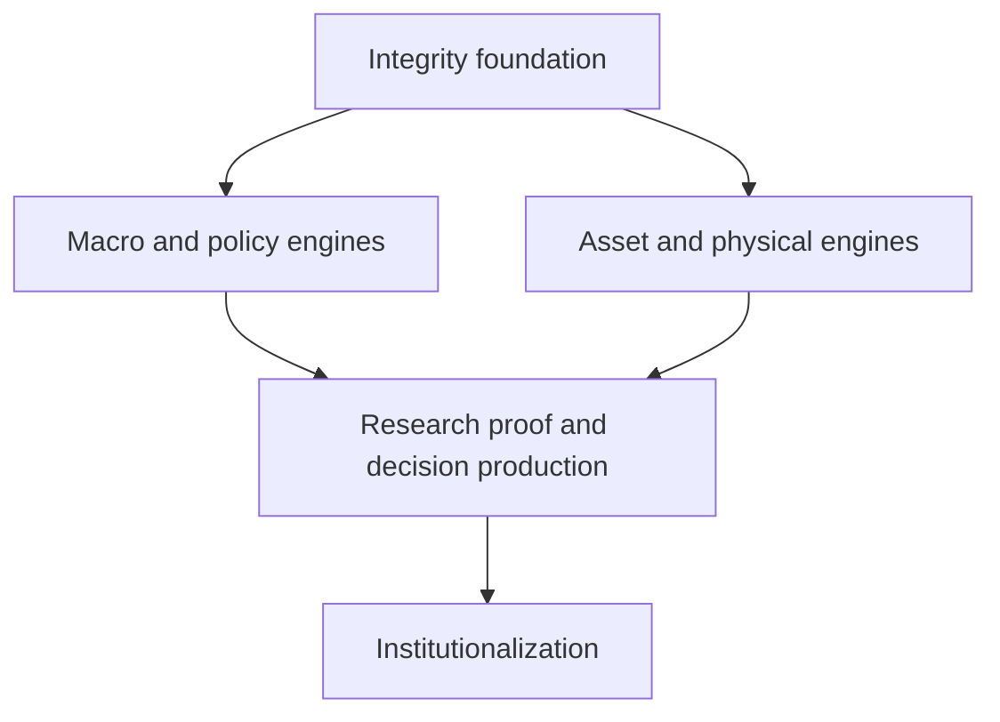

# 41 Master Dependency Graph and Release Trains

## Release trains

### Release A — Integrity foundation

Phases 1–6: target state, fundamental-only boundary, de-duplication, claim evidence, point-in-time data and master data.

### Release B — Macro and policy engines

Phases 7–18: accounting, growth, inflation, labor, central banks, rates, sovereign plumbing, fiscal, dollar, FX, banks and NBFI.

### Release C — Asset and physical engines

Phases 19–31: corporate, equities, credit, commodities, gold, energy, derivatives, market structure, flows, countries, geopolitics and alternative data.

### Release D — Research proof and decision production

Phases 32–36: historical cases, model laboratory, decision engine, portfolio risk and AI agents.

### Release E — Institutionalization

Phases 37–40: governance, accreditation, production monitoring and external validation.

## Sequencing rule

A downstream team may prototype before an upstream phase is complete, but production promotion is blocked when a required dependency lacks its acceptance evidence.
