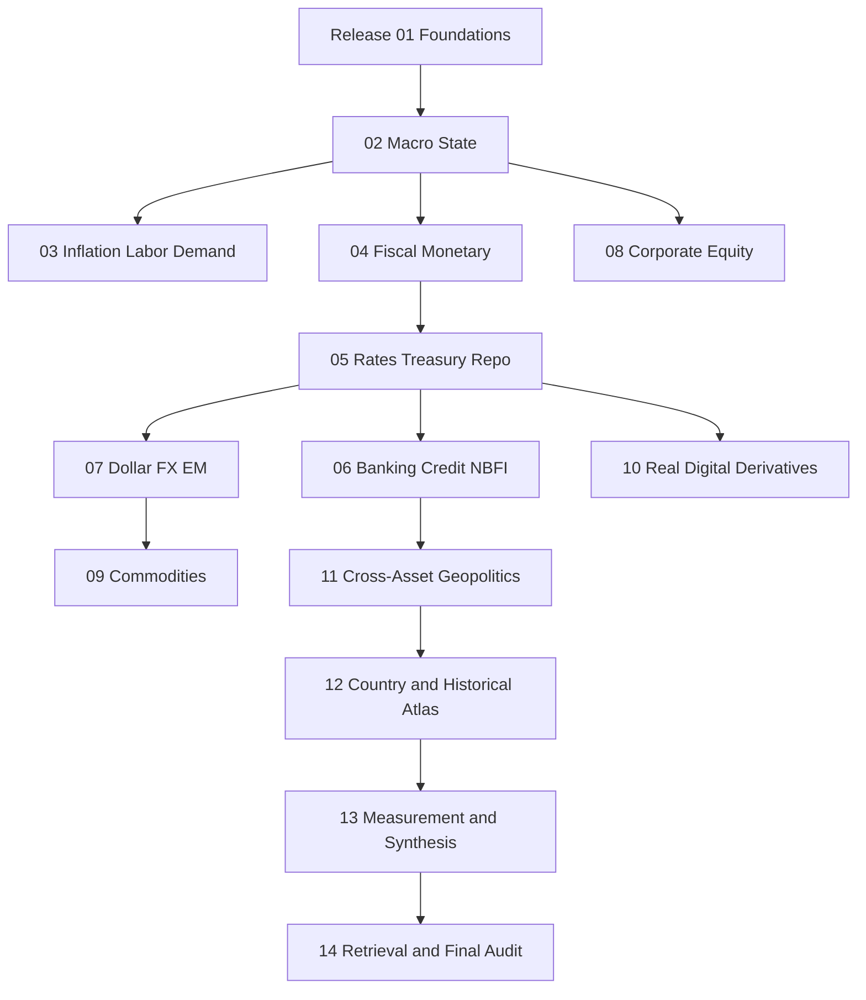

# Cross-Release Dependency and Retrieval Graph

## Retrieval rule

Start with the requested object, then retrieve its direct release, upstream state releases, financing and policy releases, relevant cross-asset release, country context, measurement method and final output contract. Do not retrieve every note indiscriminately.
