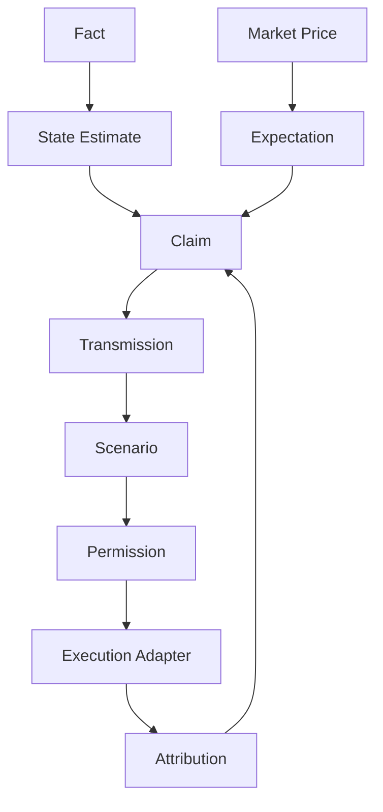

# 2022 UK LDI Crisis

## Benchmark object

- **Cutoff:** 2022-09-28 10:00 Europe/London
- **Object:** UK gilts, pensions and collateral
- **Primary mechanism:** Fiscal repricing, LDI leverage, margin calls, gilt liquidity and intervention
- **Permitted mode:** strict point-in-time reconstruction followed by a separately labelled ex-post audit.

## Reference analytical sequence

1. Resolve the exact institution, security, contract, geography and legal regime.
2. Freeze all evidence at the cutoff and exclude later revisions, retrospective labels and outcomes.
3. Reconstruct observed state, expectations, market pricing, financing constraints and positioning proxies.
4. State the primary causal chain and at least two rivals.
5. Identify the variables or markets expected to lead if the mechanism is correct.
6. Report conclusions separately for event, day, multi-day, tactical, cyclical and structural horizons.
7. Run the claim-evidence, contradiction, unknowns and false-precision gates.

## Golden mechanism key

A high-scoring answer must explain **Fiscal repricing, LDI leverage, margin calls, gilt liquidity and intervention** without treating the target-market move as proof. It must distinguish accounting identities from estimated behavior, map the constrained balance sheet or physical system, and explain why the mechanism could amplify, reverse or expire.

## Mandatory evidence ledger

| ID | Claim family | Source | Locator | Limitation |
|---|---|---|---|---|
| E01 | Measurement and institutional mechanism | [[65 Source Registry and Claim Lineage/BOE — Bank of England|BOE — Bank of England]] | Use the exact table, chapter, filing item, series or methodology section relevant to the claim. | Confirm coverage, timing, revisions and jurisdiction before inference. |
| E02 | Measurement and institutional mechanism | [[65 Source Registry and Claim Lineage/BOE_YIELD_CURVES — Bank of England Yield Curves|BOE_YIELD_CURVES — Bank of England Yield Curves]] | Use the exact table, chapter, filing item, series or methodology section relevant to the claim. | Confirm coverage, timing, revisions and jurisdiction before inference. |
| E03 | Measurement and institutional mechanism | [[65 Source Registry and Claim Lineage/FSB_NBFI — Financial Stability Board NBFI Monitoring|FSB_NBFI — Financial Stability Board NBFI Monitoring]] | Global Monitoring Report data tables and vulnerability chapters | Confirm coverage, timing, revisions and jurisdiction before inference. |


## Executed internal reference answer

The UK LDI dossier maps gilt-yield increases into derivative and repo collateral calls for leveraged pension strategies. Asset sales raised yields and generated further calls, creating a liquidity spiral even where long-run liability hedging had an economic rationale. The correct answer separates pension solvency from collateral liquidity, fiscal-announcement effects from global rates, and the Bank of England’s temporary market-function intervention from monetary-policy stance.

### Horizon and inference controls

- **Event/day:** identify the immediate information shock, constrained market or balance sheet and the first admissible confirming evidence.
- **Multi-day/tactical:** explain persistence, policy response, funding, positioning and the information expected next.
- **Cyclical/structural:** state whether the event changes the underlying regime or only reveals an existing fragility.
- **Rival model:** preserve at least one mechanism that can explain the same observed move.
- **Ex-post boundary:** later outcomes are used only to evaluate the prior process, not to rewrite the ex-ante information set.

### Reference verdict

This dossier is an internally authored golden mechanism key. It is sufficiently specific for retrieval and scoring, but it is not independently peer reviewed. A benchmark run must record the generated answer, prompt version, retrieved notes, reviewer identities, category scores and adjudicated errors.

## Common failure deductions

- **-20:** uses information, revisions or outcomes unavailable at the cutoff.
- **-15:** fails to resolve the correct instrument, contract, issuer or legal regime.
- **-15:** substitutes a single narrative for rival models.
- **-10:** counts mechanically related market moves as independent evidence.
- **-10:** invents consensus, dealer inventory, positioning or proprietary data.
- **-10:** mixes judgmental scenario weights with empirical probabilities.
- **-10:** omits the strongest contradictory evidence or unknown.
- **-5:** fails to separate horizons, invalidation and expiry.

## Internal reference material

### Consolidated legacy note: 2022 Inflation Rates FX and LDI Crisis

Inflation analysis separates level, momentum, breadth, persistence, relative-price shocks, margins, wages, rents, and policy-relevant underlying pressure.

For **2022 Inflation Rates FX and LDI Crisis**, the relevant institutional domain is **orientation**: the institutional research process, its roles, information boundaries, controls, and decision handoffs. Classify every input as observation, derived measurement, model estimate, market-implied estimate, forecast, causal claim, scenario assumption, judgment, or decision rule.

For **2022 Inflation Rates FX and LDI Crisis**, document every variable, unit, convention, sample, parameter, regularizer, and uncertainty estimate. An identity constrains possible stories; it does not estimate an elasticity or prove a causal channel.

### Consolidated legacy note: Building the Alpha Lab Context Layer

This material survived consolidation because it contains subject-specific instruction for **Building the Alpha Lab Context Layer**, not the former repeated institutional wrapper.

This note translates the vault into a machine-readable Alpha Lab context system while preserving meaning.

The context layer should not output “BUY” or “SELL” from raw news. It should compile:

```text
Facts
→ state estimates
→ expectation estimates
→ pricing gaps
→ transmission claims
→ scenarios
→ permissions
→ execution constraints
```



- source schemas;
- state models;
- expectation models;
- transmission rules;
- scenario compiler;
- permission policy;
- execution adapter.

```yaml
permission: SHORT_ONLY
because:
  - inflation surprise raised path pricing
  - real yields and USD confirmed
  - NQ breadth deteriorated
against:
  - credit remained stable
confidence: 0.74
expires_at:
vetoes:
```

1. data correctness;
2. timestamp/vintage integrity;
3. semantic correctness;
4. causal plausibility;
5. historical conditional behavior;
6. walk-forward performance;
7. live shadow consistency;
8. operational resilience.

- mark input stale;
- degrade confidence;
- avoid imputation for critical simultaneous confirmations;
- output `UNCONFIRMED` or `NO_TRADE`;
- preserve the last valid state separately;
- never silently fabricate certainty.

- “When growth weakened but credit remained stable and real yields fell, how did NQ continuation setups perform?”
- “Which evidence caused permission changes?”
- “Which macro filters reduced drawdown but removed profitable trades?”
- “Which relationships failed by regime?”

### Consolidated legacy note: FCA — UK Financial Conduct Authority

> [!source] Canonical institutional source
> **Source key:** `FCA`
> **Publisher/resource:** UK Financial Conduct Authority
> **Canonical URL:** `https://www.fca.org.uk/`

- [[77 Institutional Evidence and Monograph Production Standard/08 Source Contract Production Standard]]
- [[77 Institutional Evidence and Monograph Production Standard/10 Citation Locator and Archival Standard]]
- [[00 Core Standards/03 Point-in-Time and Bitemporal Data Standard]]

### Consolidated legacy note: 19 UK Gilt and Sterling Rates Driver Book

**19 UK Gilt and Sterling Rates Driver Book** is a research object inside conversion of macro information into horizon-specific permissions, scenario paths, implementation handoffs, and auditable trade management. The analyst must isolate the measurable state, the expectation already embedded in prices, the mechanism connecting them, and the horizon on which that inference can survive.

For **19 UK Gilt and Sterling Rates Driver Book**, the relevant institutional domain is **trading**: conversion of macro information into horizon-specific permissions, scenario paths, implementation handoffs, and auditable trade management. Classify every input as observation, derived measurement, model estimate, market-implied estimate, forecast, causal claim, scenario assumption, judgment, or decision rule.

$$
Edge(a,h)=\sum_s[P_{desk}(s)-P_{mkt}(s)]Payoff(a,s,h)-Cost(a,h)
$$

For **19 UK Gilt and Sterling Rates Driver Book**, document every variable, unit, convention, sample, parameter, regularizer, and uncertainty estimate. An identity constrains possible stories; it does not estimate an elasticity or prove a causal channel.

## Scoring status

This packet is an **internal golden reference**, not an external scientific certification. External review remains pending. A report is compared against the mechanism key, admissible evidence set and failure deductions; prose similarity is irrelevant.
